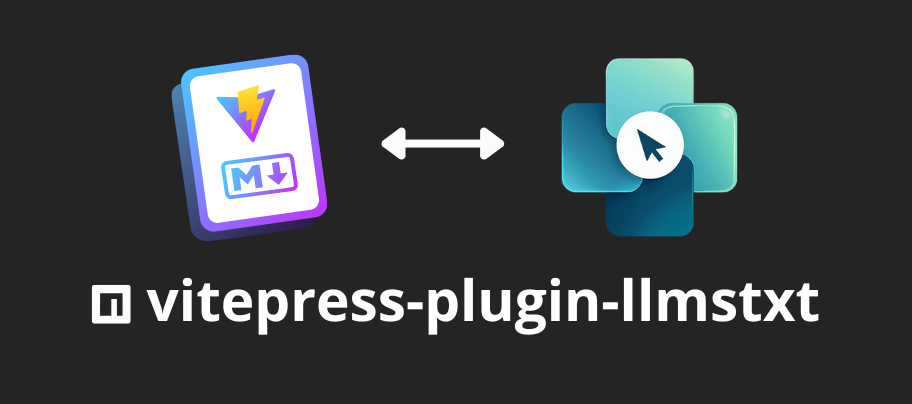

# VitePress Plugin LLMS Text



[](/LICENSE)
[](https://www.npmjs.com/package/vitepress-plugin-llmstxt)
[](https://www.npmjs.com/package/vitepress-plugin-llmstxt)
[](https://www.npmjs.com/package/vitepress-plugin-llmstxt)

This plugin **automatically** generates **LLMS text files** (`llms.txt` and `llms-full.txt`) for VitePress projects. 
It can be used to create useful metadata files and provide structured information for large language models (_LLMs_).
 

## 🗂️ Index

- ✨ [Features](#-features)
- 🔑 [Installation](#-installation)
- 📖 [Usage](#-usage)
- ⚙️ [Configuration](#%EF%B8%8F-configuration)
- 💡 [Examples](#-examples)
- 💡 [Client Examples](#client-examples)
- 👨‍💻 [Contribute](#-contribute)


## ✨ Features

- **Simple** to use _(no configuration required)_.
- **lightweight** and **zero dependencies**.
- Automatically Generates a `llms.txt` of all pages.
- Automatically Generates a `llms-full.txt` of all pages.
- Automatically Generates `.md` files for each page.
- Supports **Ignoring** certain routes.
- Supports custom **frontmatter** addition.
- Supports **transformation** of page data via a callback.
- Supports for building only certain files.
- Generates a table of contents (**TOC**).
- Follows the https://llmstxt.org/ standard.

## 🔑 Installation

Install the plugin:

```bash
npm install vitepress-plugin-llmstxt
# or
pnpm install vitepress-plugin-llmstxt
# or
yarn add vitepress-plugin-llmstxt
# or
bun add vitepress-plugin-llmstxt
# or
deno add vitepress-plugin-llmstxt
```

## 📖 Usage

Import and use the plugin in your _VitePress_ configuration:

```typescript
import { defineConfig } from 'vitepress';
import llmstxtPlugin from 'vitepress-plugin-llmstxt';

export default defineConfig({
  vite: {
    plugins: [llmstxtPlugin()],
  },
});
```

## ⚙️ Configuration

This plugin requires no configuration, but if you need specific settings, it can be flexibly configured to suit any use case.

- 👉 [See d.ts](https://unpkg.com/vitepress-plugin-llmstxt/dist/index.d.ts)

The plugin supports the following configuration options:


### `hostname` (string)
The base URL to use for generated links.  
**@example** `'https://example.org'`  
Defaults to the server's origin if not specified.

### `ignore` (string[])
An array of glob patterns to exclude from processing.  
**@example** `["**/guide/api.md"]`

### `llmsFile` (boolean | object)
Whether to generate the main `llms.txt` file.  
Defaults to `true`.

If passed as an object, you can control additional options:

#### `indexTOC` (boolean | 'only-llms' | 'only-web' | 'only-llms-links' | 'only-web-links')
Controls the content of the table of contents inside the `llms.txt` file.

- `'only-llms'` - Only the title with LLMs links  
- `'only-web'` - Only the title with web links  
- `'only-llms-links'` - Only the LLMs links  
- `'only-web-links'` - Only the web links  
- `true` - Show both  
- `false` - No index included  

### `llmsFullFile` (boolean)
Whether to generate the extended `llms-full.txt` file.  
**@default** `true`

### `mdFiles` (boolean)
Whether to generate a `.md` file for each route.  
**@default** `true`

### `transform` (function)
A callback to transform each page's data before writing it.  
It receives:

```ts
{
  page: LlmsPageData,
  pages: LlmsPageData[],
  vpConfig?: VPConfig,
  utils: {
    getIndexTOC: (type: IndexTOC) => string,
    removeFrontmatter: (content: string) => string
  }
}
```

You can use this to mutate `page.content`, add or remove metadata, or conditionally skip pages.


## 💡 Examples

```ts
import { defineConfig } from 'vitepress';
import llmstxtPlugin from 'vitepress-plugin-llmstxt';

export default defineConfig({
  vite: {
    plugins: [
      llmstxtPlugin({
        hostname: 'https://example.com',
        ignore: ['*/api/**/*'],
        llmsFile: {
          indexTOC: 'only-llms',
        },
        llmsFullFile: true,
        mdFiles: false,
        transform: ({ page, pages }) => {
          if (page.path === '/llms.txt') {
            page.content = `Structured information designed to provide useful metadata to large language models (LLMs)\n\n` + page.content;
          }
          return page;
        },
      })
    ],
  },
});
```

- 👉 [More](https://github.com/angelespejo/vitepress-plugin-llmstxt/tree/main/examples)

### Client examples

You can display your call information on the frontend.
Here's an example:

#### .vitepress/theme/components/llmstxt.vue

```html
<script setup>

	import { computed } from 'vue'
	import { getRouteData } from 'vitepress-plugin-llmstxt/client' 

	const llmsPath = computed( () => {
		const llmsData = getRouteData()
		return llmsData?.path
	} )

</script>

<template>
	<div
		class="llmstxt-section"
		v-if="llmsPath"
	>
		<p class="outline-title">
			LLM Resources
		</p>
		<ul>
			<li>
				<a
					:href="llmsPath"
					target="_blank"
					class="VPLink link"
				>
					llms.txt
				</a>
			</li>
		</ul>
	</div>
</template>

<style>
	.llmstxt-section {
		margin: 25px 0px 5px 0px;
	}
	.llmstxt-section li {
		margin: 5px;
	}
	.llmstxt-section a {
		font-size: small;
		margin: 0;
		color: var(--vp-c-text-2);
		transition: color 0.5s;
	}
	.llmstxt-section a:hover {
		color: var(--vp-c-text-1);
		transition: color 0.25s;
	}
</style>

```

#### .vitepress/theme/index.{ts,js}

```js
import DefaultTheme from 'vitepress/theme'
import { h }        from 'vue'
import Llmstxt from './components/llmstxt.vue'

/** @type {import('vitepress').Theme} */
export default {
	extends : DefaultTheme,
	Layout( ) {
		return h( DefaultTheme.Layout, null, { 'aside-outline-after': () => h( Llmstxt ) } )
	},

}
```

- 👉 [More](https://github.com/angelespejo/vitepress-plugin-llmstxt/tree/main/examples/.vitepress/theme)

## 👨‍💻 Contribute

`vitepress-plugin-llmstxt` is an open source project and its development is open to anyone who wants to participate.


- 🐛 [Report issues](https://github.com/angelespejo/vitepress-plugin-llmstxt/issues)
- 🚀 [Pull request](https://github.com/angelespejo/vitepress-plugin-llmstxt/pulls)
- ⭐️ [Star the repository](https://github.com/angelespejo/vitepress-plugin-llmstxt)
- ❤️ [Support](https://github.com/sponsors/angelespejo)
- 👀 [See code](https://github.com/angelespejo/vitepress-plugin-llmstxt/tree/main/src)


